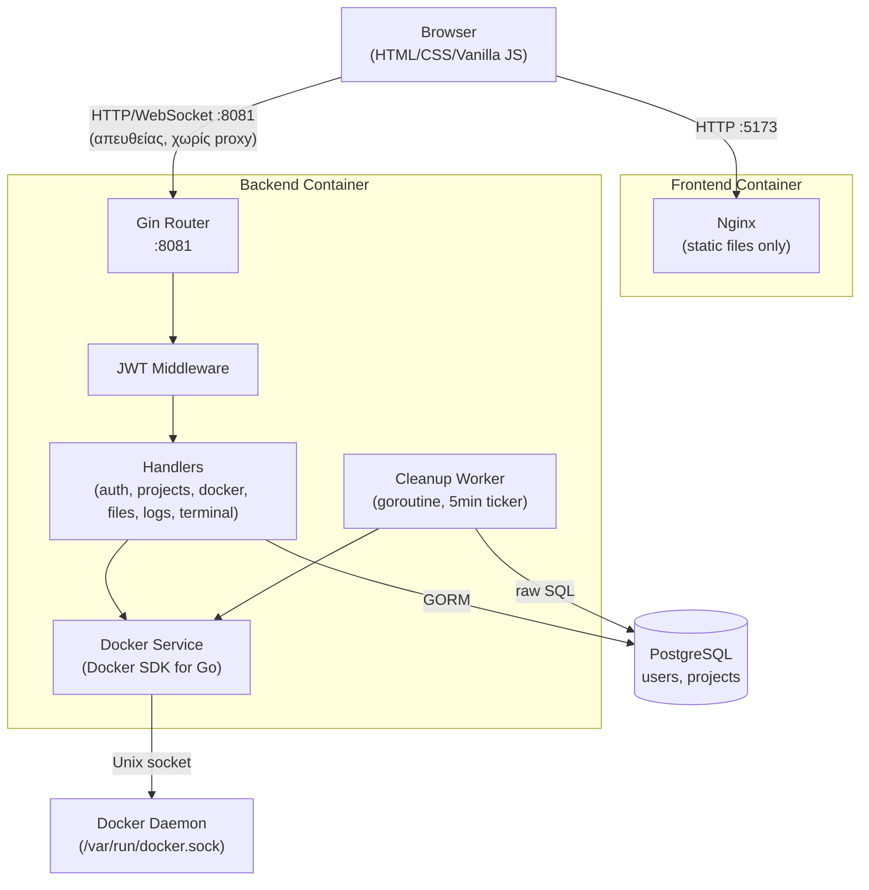
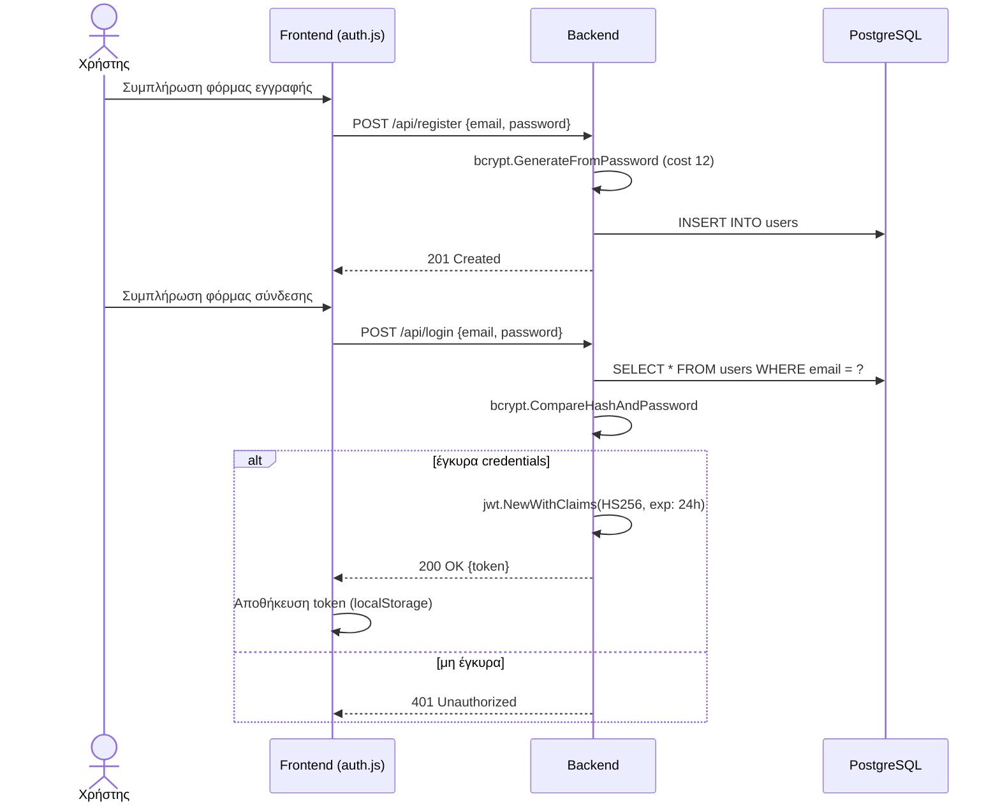
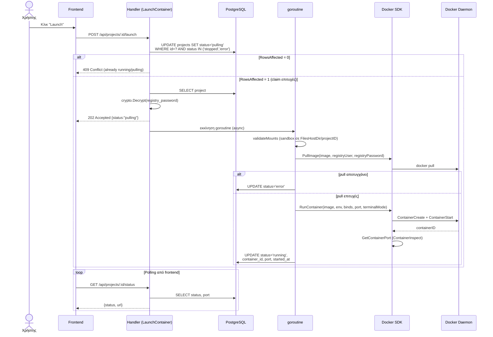
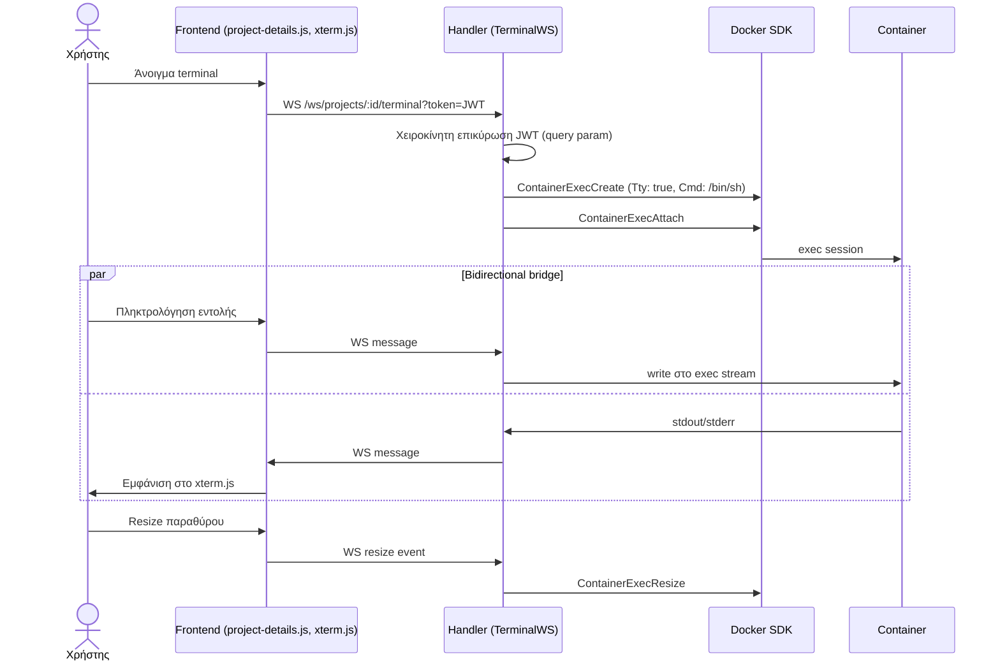
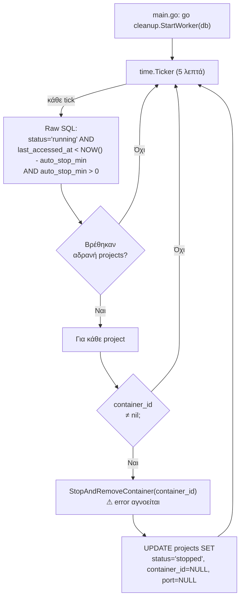
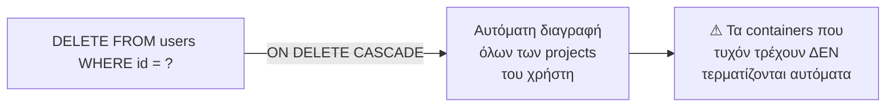

# DockYard — Program Flow

Διαγράμματα ροής της εφαρμογής, βασισμένα στον πραγματικό κώδικα του backend (`/home/pc/DockYard/backend/`).

---

## 1. Αρχιτεκτονική Υψηλού Επιπέδου

---

## 2. Εγγραφή και Σύνδεση Χρήστη (Register / Login)

---

## 3. Εκκίνηση Container (Launch Project)

Η πιο σύνθετη ροή του συστήματος. Χρησιμοποιεί atomic claim στη βάση δεδομένων για αποφυγή race condition (διπλή εκκίνηση από ταυτόχρονα αιτήματα), και εκτελεί την πραγματική εργασία ασύγχρονα σε goroutine.

---

## 4. WebSocket Terminal

---

## 5. Αυτόματος Τερματισμός Αδρανών Containers (Cleanup Worker)

> **Σημείωση:** Ο worker δεν επαληθεύει την πραγματική κατάσταση του container μέσω `ContainerInspect` πριν την ενημέρωση της βάσης — βλ. Κεφάλαιο 8 για συζήτηση αυτού του ορίου σχεδιασμού.

---

## 6. Διαγραφή Χρήστη (Cascade Delete)

